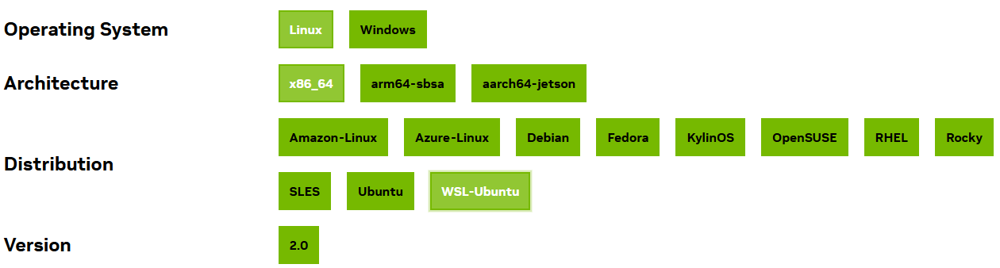

This is a drive-by course from the Nvidia Deep Learning Institute, and is named _An Even Easier Introduction to CUDA_.

The Jupyiter Notebooks runs on NVIDIA infrastructure, and I saw a Telsa T4 label on the instance.

My intention for bringing this onto my Github is to keep a copy for myself, write some notes, and maybe even run it on my local hardware.  That means installing more NVIDIA tools.


# nvcc

If I run `nvcc` at my Ubuntu 24 CLI, I see the following:

```
 ~/code/marcoman/nvidia/nvidia-cpp  nvcc
Command 'nvcc' not found, but can be installed with:
sudo apt install nvidia-cuda-toolkit
```

Before I run that apt install command, I want to ensure I'm getting the correct version.  From my previous python experiments, I know I'm running a CUDA-enabled GPU (RTX 3060), and I can get the tools.

The CUDA Toolkit 12.6 Update 1 Downloads are available at https://developer.nvidia.com/cuda-downloads, and I have been through the setup process before on my WSL2-enabled system with the following URL:

[Ubuntu-24 on WSL2](https://developer.nvidia.com/cuda-downloads?target_os=Linux&target_arch=x86_64&Distribution=WSL-Ubuntu&target_version=2.0&target_type=runfile_local)

At this time, it is worth to me to note we have other Linux distributions available.  I'm especially curious about Rocky, since I haven't used it before.  (some other time)



I already installed packages for my work with Python, and that went well.  I next cloned the [cua-samples](https://github.com/NVIDIA/cuda-samples) repository from Github and I am successful with building several of the projects, so I believe I have all the appropriate libraries and tools.  NOTE: The repository cites CUDA 12.5 at this time, and I am running with 12.6u1 and that all seems good.


# TODOs

- ensure you have the following tools
    - c++ build tools
    - nvprof
    - nvcc
    - The NVIDIA toolkit 


# Linkes


- [CUDA Toolkit documentation](https://docs.nvidia.com/cuda/index.html)
- [Quick Start Guide](https://www.google.com/url?q=https%3A%2F%2Fdocs.nvidia.com%2Fcuda%2Fcuda-quick-start-guide%2Findex.html)
- [Programming Gudie](https://www.google.com/url?q=https%3A%2F%2Fdocs.nvidia.com%2Fcuda%2Fcuda-c-programming-guide%2Findex.html)
- [Best Practices Guide](https://www.google.com/url?q=https%3A%2F%2Fdocs.nvidia.com%2Fcuda%2Fcuda-c-best-practices-guide%2Findex.html)


# Next steps

Consider taking the [Fundamentals of Accelerated Computing with CUDA C/C++](https://www.google.com/url?q=https%3A%2F%2Fcourses.nvidia.com%2Fcourses%2Fcourse-v1%3ADLI%2BC-AC-01%2BV1%2Fabout) Course
